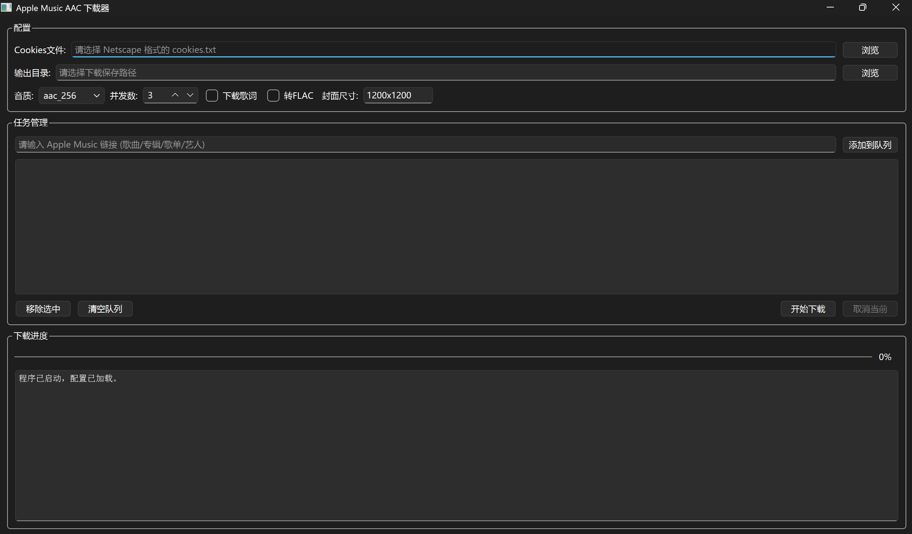

# applemusic-aac-gui
 基于 [gamdl](https://github.com/glomatico/gamdl) 和 [AppleMusic-Downloader](https://github.com/wenfeng110402/AppleMusic-Downloader) 思路开发的图形化 Apple Music 下载工具，支持 AAC 256kbps、歌词、封面、转 FLAC 等特性。



[详细使用教程](./Use-Steps.md)

[English](./README-EN.md)


## ✨ 功能特点

* 🎵 下载 Apple Music 歌曲、专辑、歌单、艺人页面（需订阅）

* 🔉 音质可选：AAC 48\~256 kbps（默认 256）
 
* 📄 下载同步歌词（.lrc）和嵌入歌词

* 🖼️ 自定义封面尺寸（如 600x600）
 
* 🔄 支持将 AAC（m4a）转码为 FLAC 无损格式（需 FFmpeg）

* 📋 批量队列下载，支持并发数设置
 
* ⚙️ 配置持久化（封面尺寸、歌词、转 FLAC 自动保存）
 
* 🖥️ 图形界面基于 PySide6，跨平台（Windows / macOS / Linux）

## 📦 依赖

* Python 3.10+

* [gamdl](https://github.com/glomatico/gamdl) ≥ 2.7.0
 
* [FFmpeg](https://ffmpeg.org/)（用于转码，若不需要转 FLAC 可省略）
 
* PySide6（GUI 框架）

## 🚀 快速开始

### 1\. 克隆仓库

```bash
git clone https://github.com/Zhischooler/apple-music-aac-gui.git
cd apple-music-aac-gui
```

2. 安装依赖

```bash
pip install -r requirements.txt
```

3. 安装 FFmpeg（如需转 FLAC）

· Windows：下载 ffmpeg.org 并添加到 PATH。

· macOS：brew install ffmpeg

· Linux：sudo apt install ffmpeg（或其他包管理器）

4. 获取 Cookies

使用浏览器扩展（如 Get cookies.txt LOCALLY）从 music.apple.com 导出 cookies.txt（Netscape 格式）。

5. 运行

```bash
python apple_music_gui.py
```

⚙️ 配置文件

程序首次运行会自动生成 config.txt，格式如下：

```
coversize:600x600      # 封面尺寸（宽x高）
downloadlyrics:true    # 是否下载歌词
m4atoflac:false        # 是否转 FLAC
```

你可以直接修改文件或通过 GUI 实时调整，修改后会自动保存。

🛠️ 技术架构

· GUI 框架：PySide6 (Qt for Python)

· 下载引擎：gamdl（Python 包）

· 进程通信：subprocess 实时获取日志

· 配置管理：纯文本键值对

🙏 致谢

· gamdl – 核心下载实现

· wenfeng110402/AppleMusic-Downloader – 界面设计参考

📄 许可证

本项目采用 MIT License – 详见 LICENSE 文件。


⚠️ 免责声明

· 本工具仅供学习和个人使用，请勿用于商业目的或侵犯版权。

· 使用前请确保您已拥有 Apple Music 订阅，并遵守 Apple 服务条款。

· 作者不对因使用本工具造成的任何后果负责。

